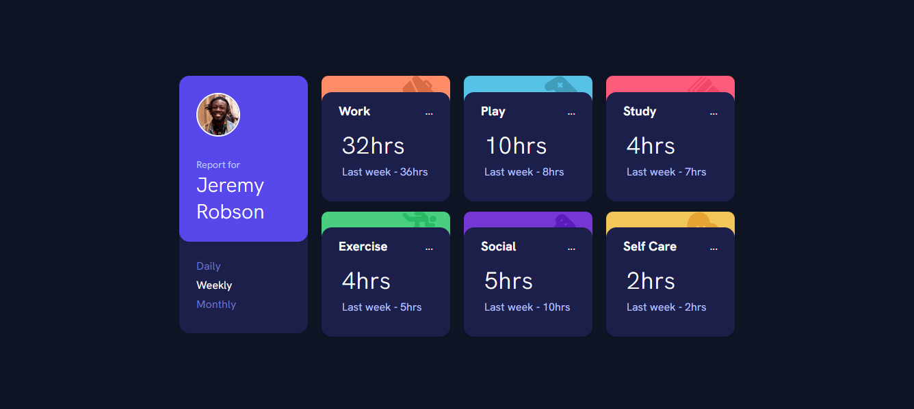

### Note of author in PT-BR

*Olá galera, mais uma solução finalizada com sucesso, devo dizer que nunca escrevi tantas linhas de CSS em uma solução como nesta, de fato não sei muito bem oque aconteceu para tantas linhas, porém me dediquei muito para diminuir minhas redundancias, acho que na verdade devo dizer que tenho um toque com organização de toque, creio que seja um defeito bom, em alguns momento, pois na maioria do tempo acho que estou fazendo algo errado e revejo o código novamente.*

                                  Time Tracking - pablodev


# pablodev - Time Tracking (Solution Frontend Mentor)

This is a solution to the [Time tracking dashboard challenge on Frontend Mentor](https://www.frontendmentor.io/challenges/time-tracking-dashboard-UIQ7167Jw). Frontend Mentor challenges help you improve your coding skills by building realistic projects. 

### Screenshot



### Links

- Solution URL: [Repositore](https://github.com/Pabloodev/time-tracking)
- Live Site URL: [URL live server](https://pabloodev.github.io/time-tracking/)

### Built with

- Semantic HTML5 markup
- CSS custom properties
- Flexbox
- CSS Grid
- Mobile-first workflow

### What I learned

Use this section to recap over some of your major learnings while working through this project. Writing these out and providing code samples of areas you want to highlight is a great way to reinforce your own knowledge.

To see how you can add code snippets, see below:


### Continued development

Little by little I'm getting along better with json, this time I already knew what to do, I like how I think, looking at a given problem and trying to solve it in the most efficient way possible.


### Useful resources

I'll leave something below that helped me a lot, but it's the script to use json in the DOM.
```
fetch('nomedoarquivo).then((response) => {
    if(!response.ok) {
        console.log('Algo deu errado na requisição!');
        return null
    }
    
    return response.json();
}).then((itens) => {
    "construa seu código aqui"
});
```


## Author

- Website - [pablodev portfolio](https://www.pabloteixeira.com)
- Frontend Mentor - [@yourusername](https://www.frontendmentor.io/profile/pabloodev)
